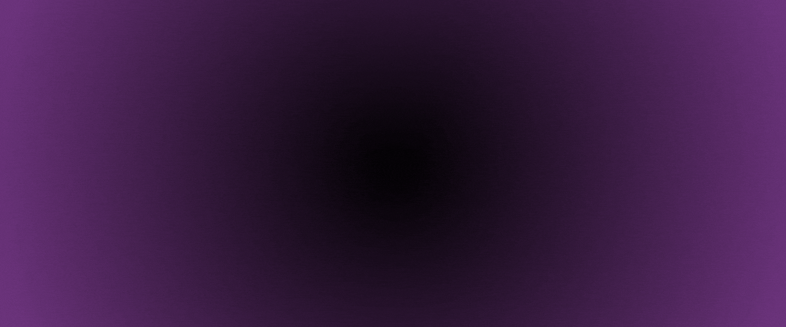

<h1 align="center" style="font-size: 2.5rem; font-weight: bold;">
  <b>Hello, I'm Cienttos</b>
  
</h1>

  

 

##  **About Me**

<picture>
  
</picture>

- Passionate self-taught Front-end developer
- Exploring new technologies
- Learning Web Development independently
- Looking for new job opportunities [Resume](#)

  

##  **Skills**

- **Languages**:
  
  

- **Frameworks**:
  
  

- **Tools & Software**:
  
  
  
  

 

## 🤝 **Let's Connect!**

<ul>
  <li>
    
  </li>
  <li>
    
  </li>
  <li>
    
  </li>
</ul>
